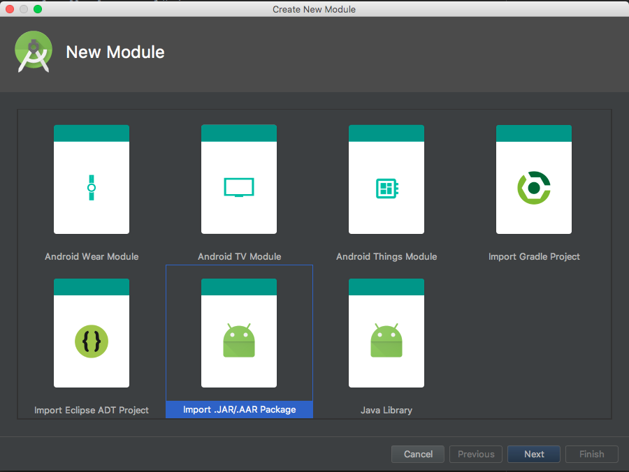
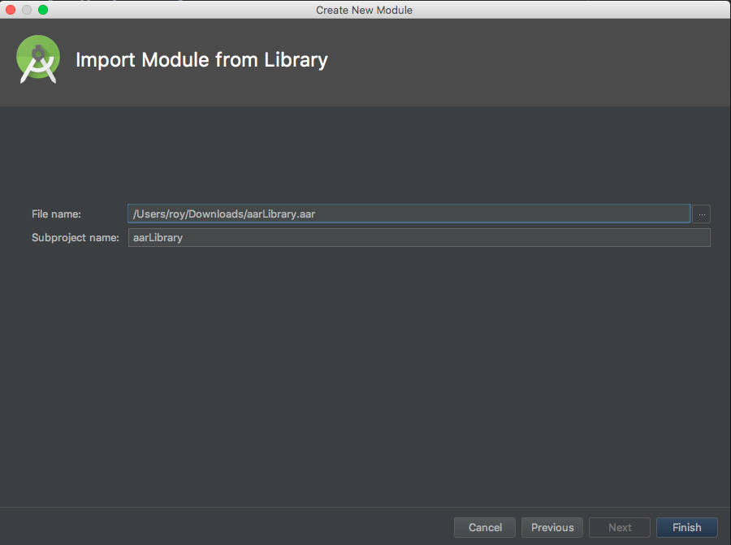
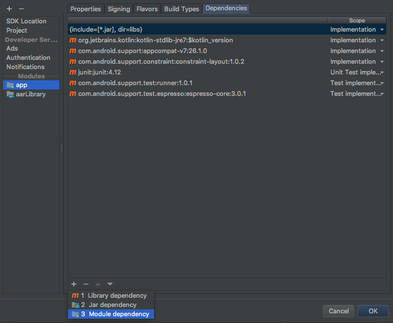

# 透過Android Studio 加入 AAR Library

在 Android Studio 中選擇 File -> New -> New Module 即可看到下圖，並選擇 Import .JAR/.AAR Package。

再來選擇要加入的 AAR Library 如下圖。

再來設定 Project Structure ，增加一個 Module 相依來源為選擇的 AAR Library。

